# Connected By Learning (Tentative Title)
## Tyler Youn 
## UCLA DH110 Spring 2023

Connecting with family can happen through shared experiences, and can be made lasting through created artifacts and knowledge. Fun and traditional activities for groups of all ages can be found in our local community centers, where courses about arts and crafts, health and fitness, and more are offered. To determine how digital tools can be used to help us connect more with our families through shared activities and coures, one app and one web app were analyzed using [Nielson's 10 Usability Heuristics for User Interface Design](https://www.nngroup.com/articles/ten-usability-heuristics/). These apps were selected based on their ability to accomplish a core task: register for an in-person/virtual course for a group of two or more family members that share a common interest like painting, yoga, or gardening. 

| Heuristic | Definition/Points | 
| --- | --- |
| 1. Visibility of System Status | Informs users about what is happening, provides feedback in reasonable amount of time |
| 2. Match Between System and the Real World | Language should be familiar to user, follow real world conventions to present information logically and naturally
| 3. User Control and Freedom | Users have freedom to undo mistakes and redo actions, clear way to exit an unwanted state
| 4. Consistency and Standards | Following conventions and standards to prevent users from being unsure about certain words, situations, or actions
| 5. Error Prevention | Preventing errors through careful design, instead of error messages | 
| 6. Recognition rather than Recall | Making options visible, providing relevant information as necessary, easily retrievable instructions 
| 7. Flexibility and Efficiency of Use | Accelerators to speed interaction with site, tailoring of most frequently used actions
| 8. Aesthetic and Minimalist Design | Minimal irrelevant or rarely needed information, making most important information visible, without distractions
| 9. Help Users Recognize, Diagnose, and Recover from Errors | If error occurs, make clear to user the problem and constructive solution | 
| 10. Help and Documentation | Easy to search, task-focused, concrete steps, not overwhelming | 

### App #1: LA County Parks & Recreation WebApp

Page             |  Screenshot
:-------------------------:|:-------------------------:
Home |  
Sign-in | 
Search | 

#### Initial Impressions

As I first landed on the home page of the app, I found it difficult to see where the activities registration was. Once I found it, I had to go through a registration process and then begin searching through the available classes. There was no application available on Apple's App Store to reserve or register for classes, so I had to resort to using the web application using Safari. The following evaluation and screenshots were taken on a small iPhone mobile device, which the webpage may not have specifically been design for. Overall, it is clear that there was limited work put into making the mobile experience good for all age groups, as it seems crowded and not organized. 

#### 1. Visibility of System Status (Severity Score: 2)
After selecting a class and clicking on apply, the user is sent to the checkout process. However, there's no status bar for the user to know how far along they are or how many steps are left. Even though there are five waivers to sign, there is no status information visible to the user of their progress. Furthermore, the waivers are placed at the bottom of the page, even though the checkout button is at the top, making it confusing for the user to determine the proper next steps and make mistakes. Thus, this heuristic is violated by the app. Given that the userbase is potentially senior citizens who will have to go through the registration process, it should be given some priority to help with accessibility, and so this heuristic was scored a 2. 

#### 2. Match Between System and the Real World (Severity Score: 2)
When searching for classes, users are shown all possible activities, including ones that are closed for registration because the deadline passed or the class is full. This could make it harder for users to parse through the classes that are open. Their sorting does not follow real-world conventions, where we would expect the non-applicable classes to be the last items in the course list. Since this problem is important to the algorithm that displays the classes at the top, we'd want to completely filter out the non-relevant information, but will only be a minor usability problem. So, it was scored a 2.

#### 3. User Control and Freedom (Severity Score: 3)
There are many courses that teach the same topics but with different locations or dates and times. It is easy for someone to select a class with a topic that they are interested in without checking the time or location. Thus, if a user does make that mistake, there should be a way that they can simply switch through the same event with different available times and locations. By doing so, the users would be able to skip the dialogue of deleting the original class, seaching for the same class name but with the desired time and location, and then adding the class to the cart. This problem was scored a 3, as it helps organize much of the course listings, and provides a high level of customizability. 

#### 4. Consistency and Standards (Severity Score: 3)
There are classes that have tags showing that it is "In-progress". This implies to the user that it may be open for registration. For some classes, this is the case, as there are no spots open left in the class. However, the course listing is inconsistent, in that once you navigate to the sign up page and attempt to register, it notifies you that the registration deadline has passed. Therefore the user is being told the same information about the classes, but getting inconsistent data when trying to register. This was scored a three, as it is a clear sign of an item not being indexed properly. Even though both classes are 'in progress', it is not clear if it is still available for registration. 

#### 5. Error Prevention (Severity Score: 1)
When registering for a class, the user must specify who the class is being enrolled for, to check age eligibility and other constraints. If someone is enrolled already in a course, and tries to enroll into the course again, it will not allow one to do so. However, this error message still occurs, we want to prevent it from happening in the first place. Namely, we want the name to not be clickable, or greyed out, to the user, such that they know that the person is not eligible or has already signed up for the class. Since it did not affect the overall functionality of the service, and the error was caught, it was scored a severity score of 1. 

#### 6. Recognition rather than Recall (Severity Score: 1)
On the search page, for each class we are given some relevant information like the topic, dates, and location. However, it is not explicit how many sessions there will be, either in total or per week. This information should be displayed, especially since these are paid activities, it is fair for customers to want to know how much each session may cost. Instead of having them calculate it themselves and figure out how the schedule will be like, having an extra line containing that information may be helpful. Since it just provides another side to the information about the dates, this was scored a 1.

#### 7. Flexibility and Efficiency of Use (Severity Score: 3)
There is a lack of a home button to return to the search page. If a user wants to navigate between where-ever they are on the website back to searching for classes again, they have to click on the sidebar and then 'Activities', which may log them out of their account. In another section, there are limited ways to filter through the available courses, to separate them from the 'Cancelled', 'Closed', and 'Full' classes. Since these dialogues are tedious and affect how the users interact with the service, it should be fixed and given priority. 

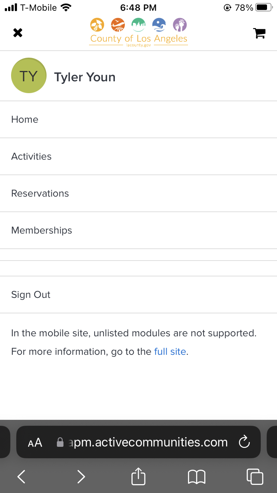

#### 8. Aesthetic and Minimalist Design (Severity Score: 3)
Once the user lands onto the LA County Reservations system, which is where you can register for classes or make reservations, they are immediately greeted with large images and walls of text which are instructions to complete the core task. Instead of the design being intuitive to navigate and use, it makes the user have to search for the next step by reading the text. It also does not help that there is a lack of spacing between different elements, which overload users with information. There are major spacing issues and information overload that should be given high priority to amend, thus it is scored a 3. 

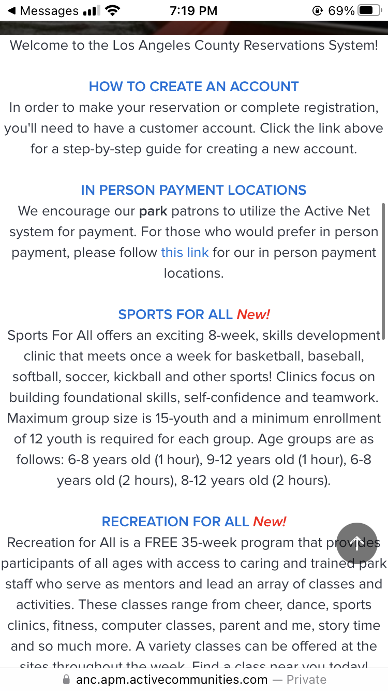

#### 9. Help Users Recognize, Diagnose, and Recover from Errors (Severity Score: 2)
From the figure provided in point 5, we can see that the information provided to the user from the error message can be confusing and cryptic. It seems that the errors were spawned from the same issue, yet two messages were given. It also does not differentiate between the two points, but simply gives a large wall of text explaining what the error is. However, it does provide a next step to the user in order to resolve this error. This heuristic was scored a 2, as although the error message may not have been incomprehensible, it was unnecessarily long. 

#### 10. Help and Documentation (Severity Score: 2) 
A Frequently Asked Question (FAQ) section is available and has a list of questions that could be useful for those who are confused or lost. It would be helpful if there were videos or some visuals to explain how to register for classes, especially for older demographics. There are some videos to aid in registration, but they are hidden on the last item of the list in the FAQ, instead of displaying them front and center of the help page. This was scored a 2, as having the resources are there, but could be organized better. 

#### Here are the final tabulated severity scores for the LA County Parks & Rec Webapp:

| Heuristic | Severity Scores (1-3)| 
| --- | --- |
| 1. Visibility of System Status | 2 |
| 2. Match Between System and the Real World | 2
| 3. User Control and Freedom |3
| 4. Consistency and Standards | 3
| 5. Error Prevention | 1
| 6. Recognition rather than Recall | 1
| 7. Flexibility and Efficiency of Use | 3
| 8. Aesthetic and Minimalist Design | 3
| 9. Help Users Recognize, Diagnose, and Recover from Errors | 2
| 10. Help and Documentation | 2

### App #2: Wondrium App

Page             |  Screenshot
:-------------------------:|:-------------------------:
Home |  
Sign-in | 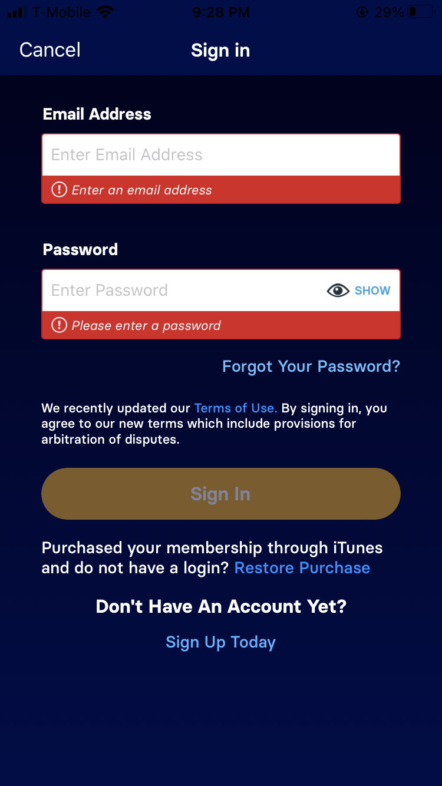
Search | 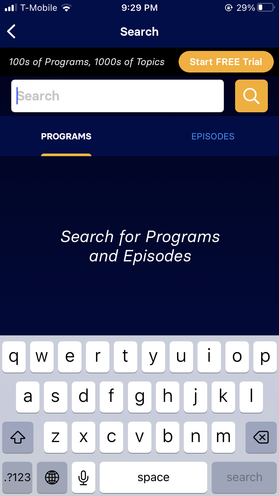

#### Initial Impressions
The previous web application is used to register for courses at the local community centers in Los Angeles county. For families who may not all be together at the same time physically, or have scheduling conflicts, applications that offer virtual courses can provide convenient methods to have an interesting and fun shared activity. Wondrium is one application that provides a catalogue of courses on various topics such as cooking, science, wine, and more. 

#### 1. Visibility of System Status (Severity Score: 2)
The response time of the app limits its effectiveness when it comes to this heuristic. As the user scrolls through the selections, once a picture is tapped, it has a 1-2 second delay before the description page for the course shows up. Instead of having the user wait and think that the system is unresponsive, there should be a visible loading bar or circle that rotates and notifies the user of the status. This issue also occurs when searching for items. This can be scored a 2 in severity, as it makes the experience laggy, but does not affect the usability too severely. 

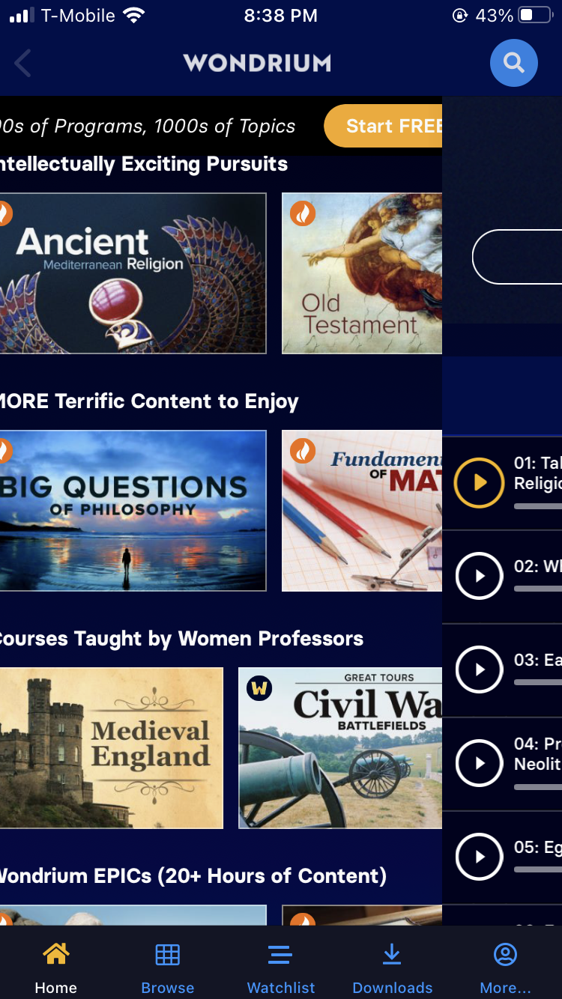

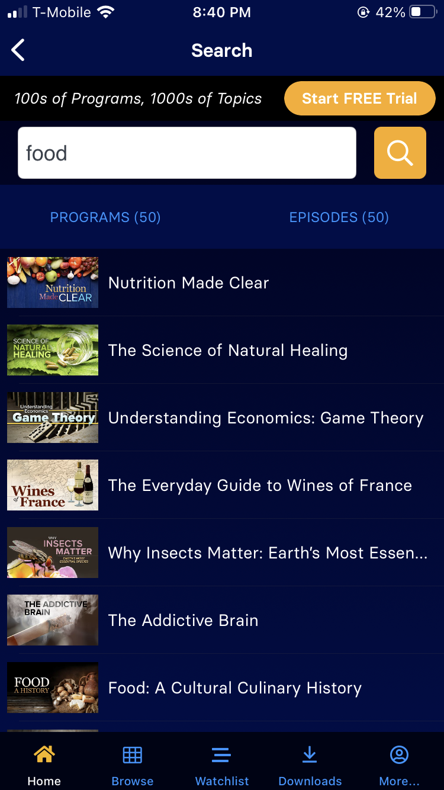

#### 2. Match Between System and the Real World (Severity Score: 1)
The home page of the app is similar to Netflix's layout, but has some issues with its sorting. For instance, the listings for the top rated courses and the most trending courses shown in the image below are not at the top but rather at the bottom. This type of arrangement is not expected to the user, as they would look for most popular movies at the top. Since it is mostly an arrangement issue that can be resolved easily, this was scored a one. 

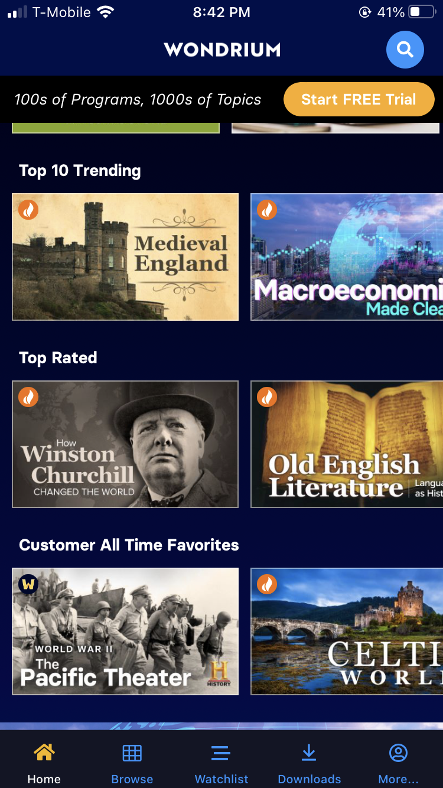

#### 3. User Control and Freedom (Severity Score: 2)
In other applications with similar functionalities, before providing a catalogue of diverse and random courses, they ask surveys or provide a short questionnaire to better tailor the home page to the user. Furthermore, they still give the option for the user to add or change the topics that they are the most interested in. This allows the user to control their experience to their own liking, without having to continuously search through an enormous catalogue without personalization. Recommending the right content to the users is an important design challenge, and not accomplishing it can mean decreased interaction and immersion, effectiving the usability of the app. Therefore, this was scored a 2. 

#### 4. Consistency and Standards (Severity Score: 2)
Once the user finds a course that they are interested in, they have the ability to add the course to their watchlist. However, they also have the ability to add individual episodes of the course to their watchlist. These two actions can both happen, and they do not relate to each other in terms of the app's functionality. However, we know that if we include the entire course to the watchlist, then we expect the individual episodes to be added as well. In other words, we should not have the ability to add these episodes. This is a severity score of 2, since it impedes the usability of the app and makes it confusing for the user.

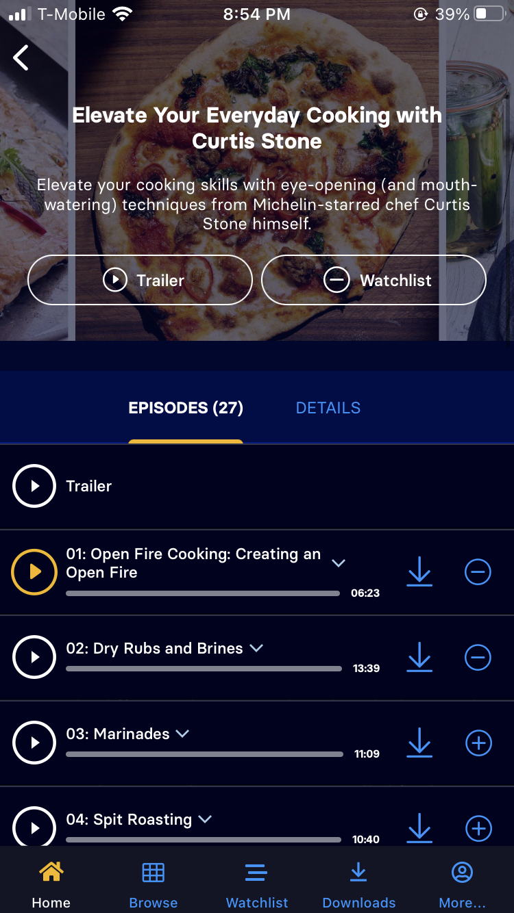

#### 5. Error Prevention (Severity Score: 1)
In the search bar, there are some usability issues that have to do with no results, rather than an error. However, these failures to retrieve results should still be either prevented or remediated. For example, when searching 'vietnamese food', there are zero matches for any courses that have that topic, but the results still show items that the engine thinks is relevant. Instead, the error message should show, that there were no results with those exact key words, and offer the results as alternatives. This is a minor cosmetic issue for this app, since results do pop up, but the user is not notified of the failure to find 'vietnamese food'. So, this heuristic was scored a 1. 

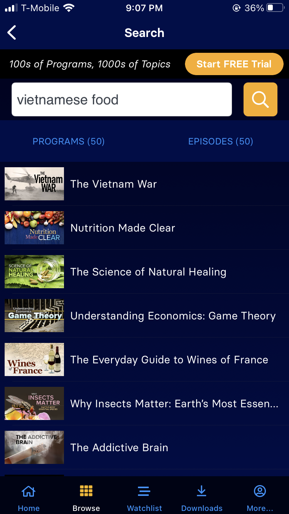

#### 6. Recognition rather than Recall (Severity Score: 1)
For the search bar, its use is limited to just searching for items. It does not save previous searches, or provide suggestions based on trending data. If the bar did provide a form of recommendation or save, then the user would not have to recall or try to remember what was searched previously. However, the home page does store previously watched content using the watchlist feature to easily pick up where the user left off. This was scored a 1, since it does have a method to prioritize content, but should still be fixed to provide recommendations based on watched content.  

#### 7. Flexibility and Efficiency of Use (Severity Score: 3)
There is a lack of a filter on the home page as well as the search page, which we can see from the image in heuristic 5. There is no way to parse through what is popular or trending on the home page, and the user is just given a large catalogue to browse. The search bar also just provides a list of matching courses based on keywords, but does not provide any way to filter those results further. Also, the watchlist where the programs and episodes are stored do not have a search or filter option for the user to browse their list, making it less efficient to find what they need. 

#### 8. Aesthetic and Minimalist Design (Severity Score: 3)
The catagories list in the Browse tab is not aesthetic, as it is just a list of words. Instead, they could have provided a small icon or image that symbolizes the category for easier recognition. Furthermore, instead of providing over 10 categories, they could have just shown 3-4 of the most popular ones at the top with larger text and images, while still providing a way to access more categories. This was scored a 3, as this navigation plays a large part in making the experience less overwhelming for the user. 

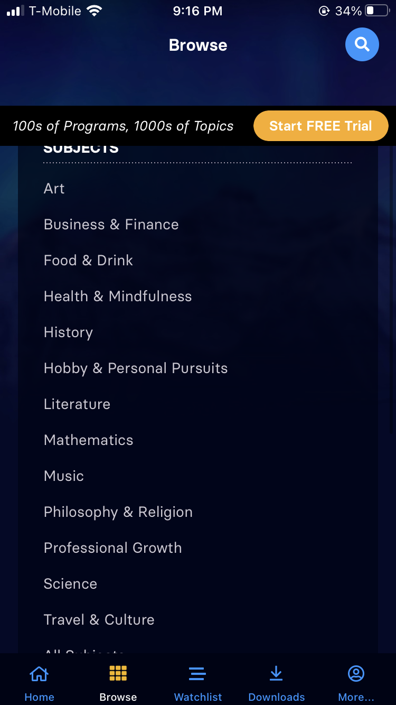

#### 9. Help Users Recognize, Diagnose, and Recover from Errors (Severity Score: 2)
The error that I was able to produce was through failing the payment process for signing up for the monthly plan of the app. The message was simple and it was easy to understand what the exact error was, but it did not provide next steps or what to do next. This was scored a 1, since producing this error is rare and generally easily resolvable if it occurs.

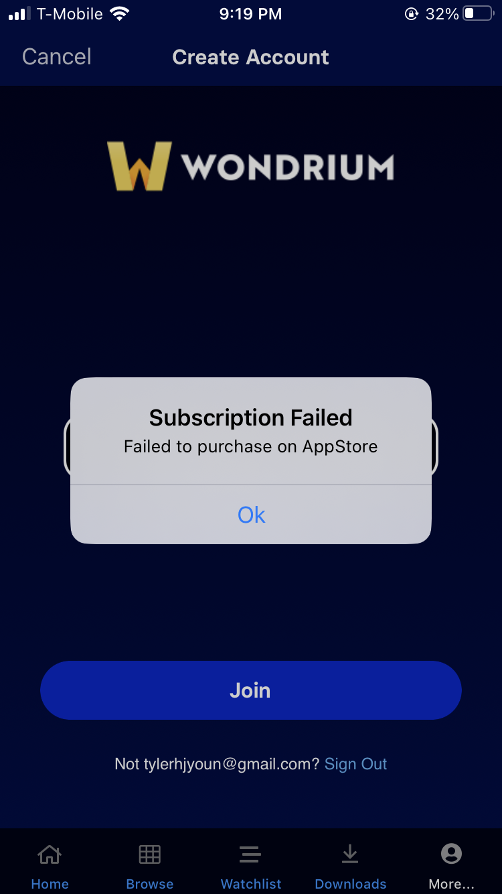

#### 10. Help and Documentation (Severity Score: 3) 
There is no FAQ or form of interactive customer support if someone was lost or confused. They do have a message center where you can message or provide feedback, but there is no direct support to assist with the app. This could be problematic if the user has no idea how to use the app and needs assistance. This was scored a 3, as having even a small FAQ would help the user experience.

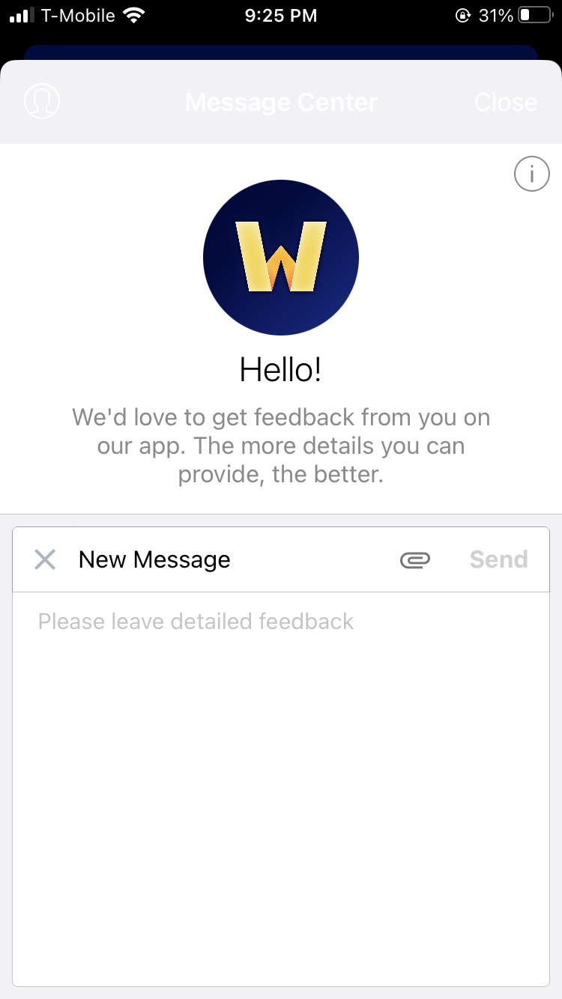

#### Here are the final tabulated severity scores for the LA County Parks & Rec Webapp:

| Heuristic | Severity Scores (1-3)| 
| --- | --- |
| 1. Visibility of System Status | 2 |
| 2. Match Between System and the Real World | 1
| 3. User Control and Freedom |2
| 4. Consistency and Standards | 2
| 5. Error Prevention | 1
| 6. Recognition rather than Recall | 1
| 7. Flexibility and Efficiency of Use | 2
| 8. Aesthetic and Minimalist Design | 3
| 9. Help Users Recognize, Diagnose, and Recover from Errors | 2
| 10. Help and Documentation | 3
