# Connected By Learning (Tentative Title)
## Tyler Youn 
## UCLA DH110 Spring 2023

Connecting with family can happen through shared experiences, and can be made lasting through created artifacts and knowledge. Fun and traditional activities for groups of all ages can be found in our local community centers, where courses about arts and crafts, health and fitness, and more are offered. To determine how digital tools can be used to help us connect more with our families through shared activities and coures, one app and one webapp were analyzed using [Nielson's 10 Usability Heuristics for User Interface Design](https://www.nngroup.com/articles/ten-usability-heuristics/). These webapp/apps were selected based on their ability to accomplish a core task: register for an in-person/virtual course for a group of two or more family members that share a common interest like painting, yoga, or gardening. 

### App #1: LA County Parks & Recreation WebApp

Page             |  Screenshot
:-------------------------:|:-------------------------:
Home |  
Sign-in | 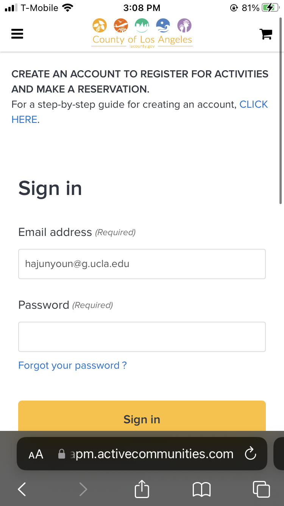
Search | 

| Heuristic | Definition/Points | Severity Rating |
| --- | --- | --- |
| 1. Visibility of System Status | 
| 2. Match Between System and the Real World
| 3. User Control and Freedom
| 4. Consistency and Standards
| 5. Error Prevention
| 6. Recognition rather than Recall
| 7. Flexibility and Efficiency of Use
| 8. Aesthetic and Minimalist Design
| 9. Help Users Recognize, Diagnose, and Recover from Errors
| 10. Help and Documentation 

#### 1. Visibility of System Status (Severity Score: 3)
After selecting a class and clicking on apply, the user is sent to the checkout process. However, there's no status bar for the user to know how far along they are or how many steps are left. Even though there are five waivers to sign, there is no status information visible to the user of their progress. Furthermore, the waivers are placed at the bottom of the page, even though the checkout button is at the top, making it confusing for the user to determine the proper next steps and make mistakes. Thus, this heuristic is violated by the app. Given that the userbase is potentially senior citizens who will have to go through the registration process, it 

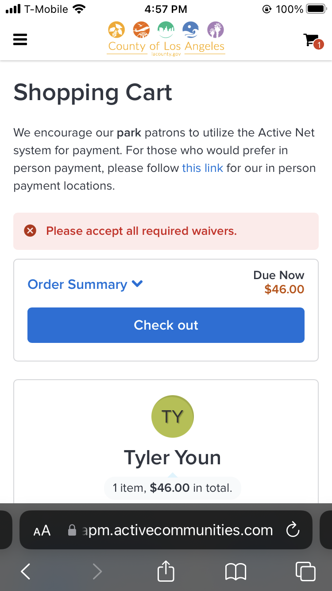

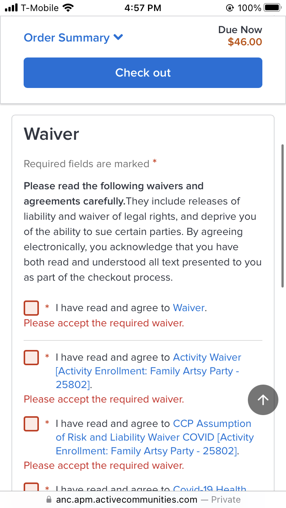

#### 2. Match Between System and the Real World (Severity Score: 3)
When searching for classes, users are shown all possible activities, including ones that are closed for registration because the deadline passed or the class is full. This could make it harder for users to parse through the classes that are open. Their sorting does not follow real-world conventions, where we would expect the non-applicable classes to be the last items in the course list. 

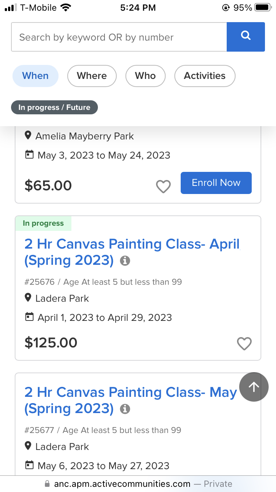

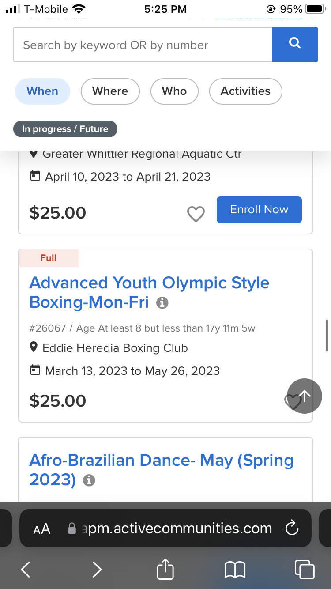

#### 3. User Control and Freedom (Severity Score: 3)
There are many courses that teach the same topics but with different locations or dates and times. It is easy for someone to select a class with a topic that they are interested in without checking the time or location. Thus, if a user does make that mistake, there should be a way that they can simply switch through the same event with different available times and locations. By doing so, the users would be able to skip the dialogue of deleting the original class, seaching for the same class name but with the desired time and location, and then adding the class to the cart. 

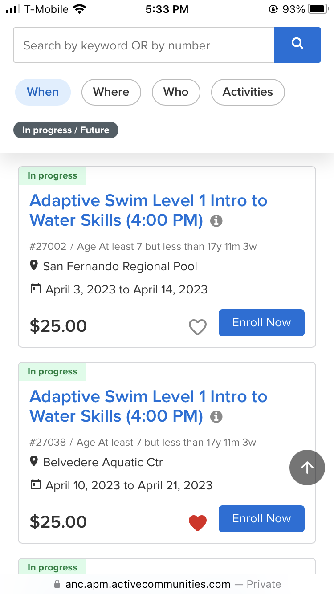

#### 4. Consistency and Standards (Severity Score: 3)
There are classes that have tags showing that it is "In-progress". This implies to the user that it may be open for registration. For some classes, this is the case, as there are no spots open left in the class. However, the course listing is inconsistent, in that once you navigate to the sign up page and attempt to register, it notifies you that the registration deadline has passed. Therefore the user is being told the same information about the classes, but getting inconsistent data when trying to register. 

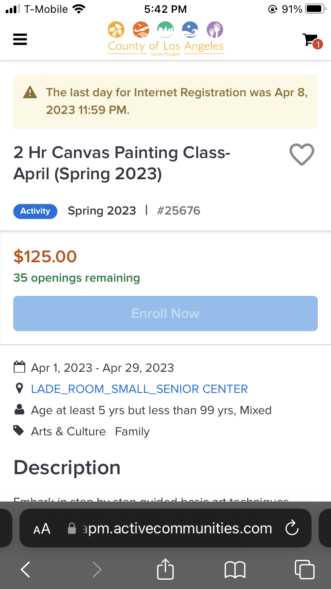

#### 5. Error Prevention (Severity Score: 3)
When registering for a class, the user must specify who the class is being enrolled for, to check age eligibility and other constraints. If someone is enrolled already in a course, and tries to enroll into the course again, it will not allow one to do so. However, this error message still occurs, we want to prevent it from happening in the first place. Namely, we want the name to not be clickable, or greyed out, to the user, such that they know that the person is not eligible or has already signed up for the class. 

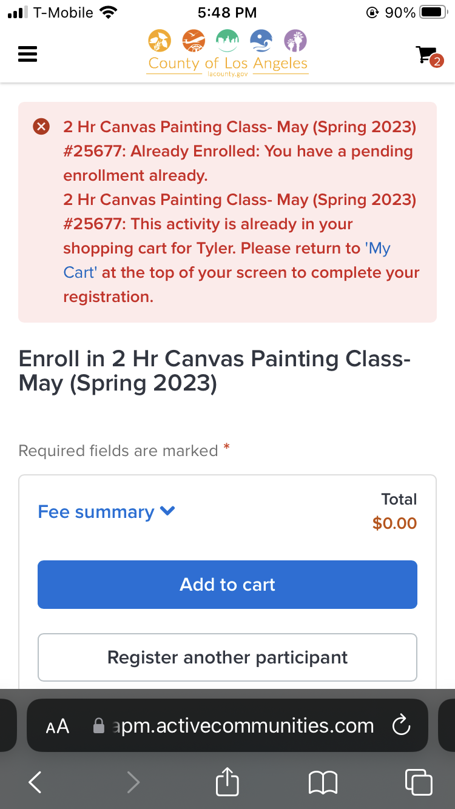

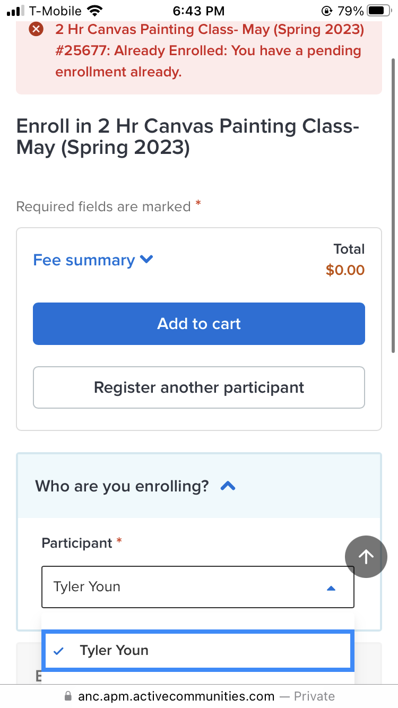

#### 6. Recognition rather than Recall (Severity Score: 3)
On the search page, for each class we are given some relevant information like the topic, dates, and location. However, it is not explicit how many sessions there will be, either in total or per week. This information should be displayed, especially since these are paid activities, it is fair for customers to want to know how much each session may cost. Instead of having them calculate it themselves and figure out how the schedule will be like, having an extra line containing that information may be helpful. 

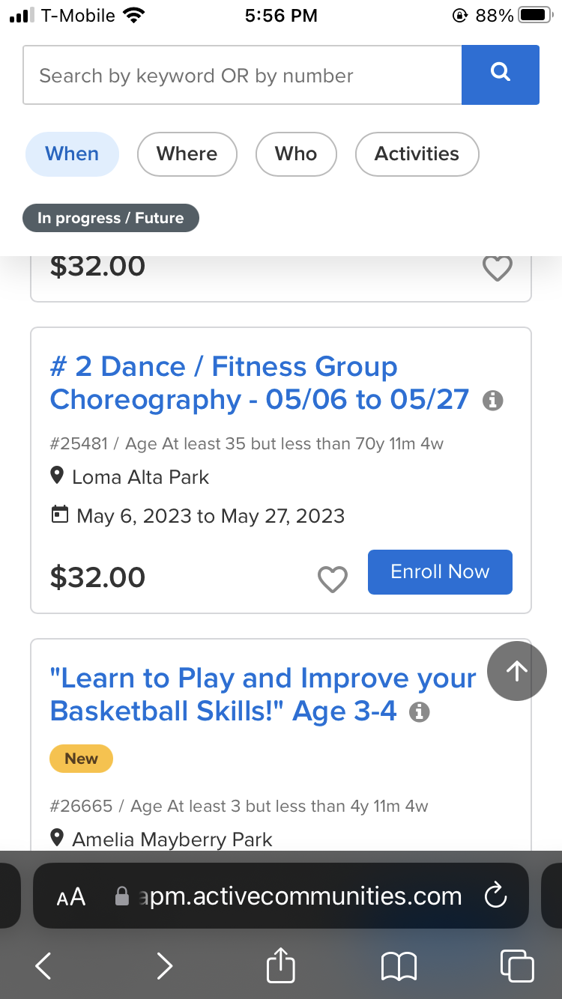

#### 7. Flexibility and Efficiency of Use (Severity Score: 3)
There is a lack of a home button to return to the search page. If a user wants to navigate between where-ever they are on the website back to searching for classes again, they have to click on the sidebar and then 'Activities', which may log them out of their account. In another section, there are limited ways to filter through the available courses, to separate them from the 'Cancelled', 'Closed', and 'Full' classes.

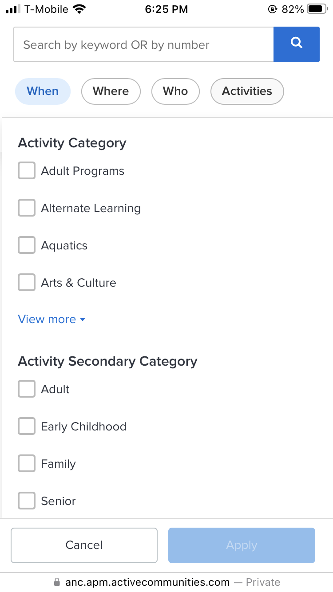

#### 8. Aesthetic and Minimalist Design (Severity Score: 3)

#### 9. Help Users Recognize, Diagnose, and Recover from Errors (Severity Score: 3)
From the figure provided in point 5, we can see that the information provided to the user from the error message can be confusing and cryptic. It seems that the errors were spawned from the same issue, yet two messages were given. It also does not differentiate between the two points, but simply gives a large wall of text explaining what the error is. However, it does provide a next step to the user in order to resolve this error. 

#### 10. Help and Documentation (Severity Score: 3) 
A Frequently Asked Question (FAQ) section is available and has a list of questions that could be useful for those who are confused or lost. It would be helpful if there were videos or some visuals to explain how to register for classes, especially for older demographics. There are some videos to aid in registration, but they are hidden on the last item of the list in the FAQ, instead of displaying them front and center of the help page. 

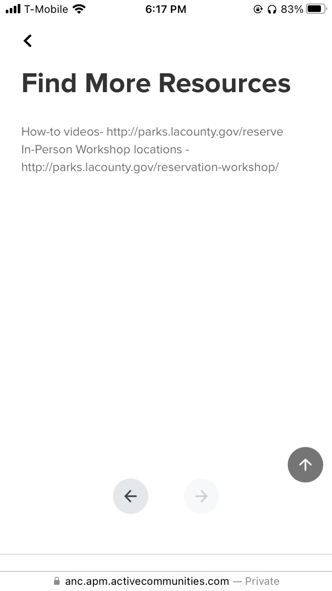

