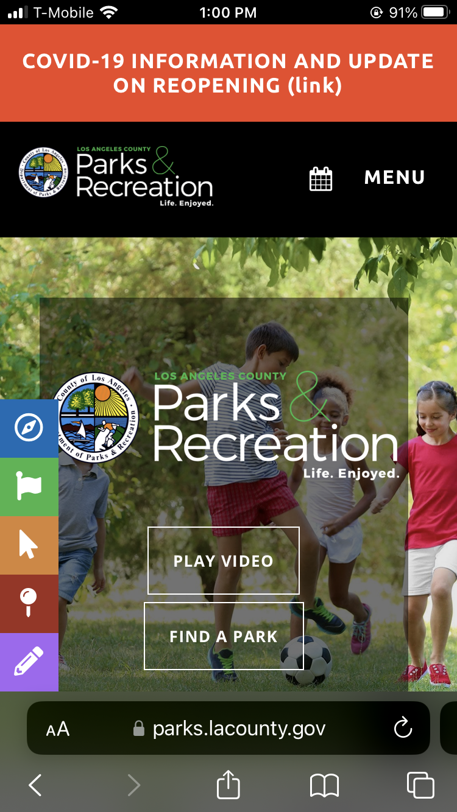
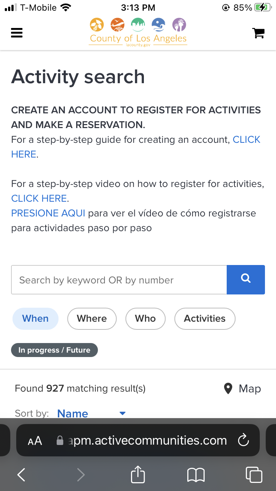

# Connected By Learning (Tentative Title)
## Tyler Youn 
## UCLA DH110 Spring 2023

Connecting with family can happen through shared experiences, and can be made lasting through created artifacts and knowledge. Fun and traditional activities for groups of all ages can be found in our local community centers, where courses about arts and crafts, health and fitness, and more are offered. To determine how digital tools can be used to help us connect more with our families through shared activities and coures, one app and one webapp were analyzed using [Nielson's 10 Usability Heuristics for User Interface Design](https://www.nngroup.com/articles/ten-usability-heuristics/). These webapp/apps were selected based on their ability to accomplish a core task: register for an in-person/virtual course for a group of two or more family members that share a common interest like painting, yoga, or gardening. 

### App #1: LA County Parks & Recreation WebApp

Page             |  Screenshot
:-------------------------:|:-------------------------:
Home |  
Sign-in | 
Search | 

| Heuristic | Evaluation | Severity Rating |
| --- | --- | --- |
| 1. Visibility of System Status | c | c |
| 2. Match Between System and the Real World
| 3. User Control and Freedom
| 4. Consistency and Standards
| 5. Error Prevention
| 6. Recognition rather than Recall
| 7. Flexibility and Efficiency of Use
| 8. Aesthetic and Minimalist Design
| 9. Help Users Recognize, Diagnose, and Recover from Errors
| 10. Help and Documentation 

