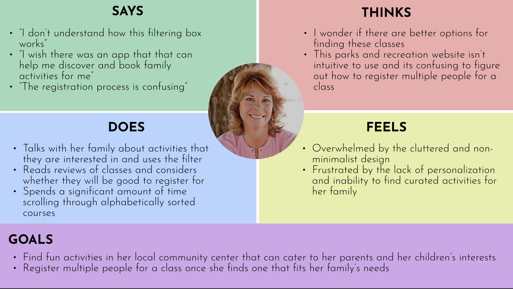
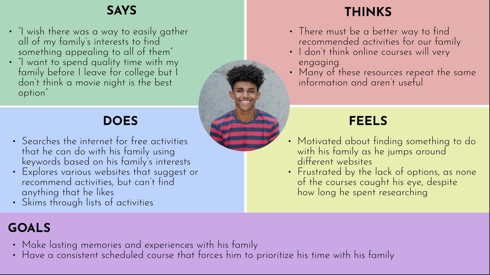
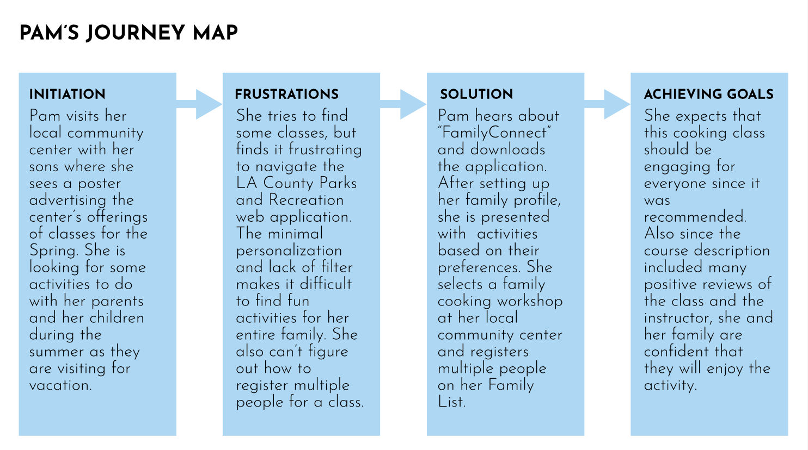
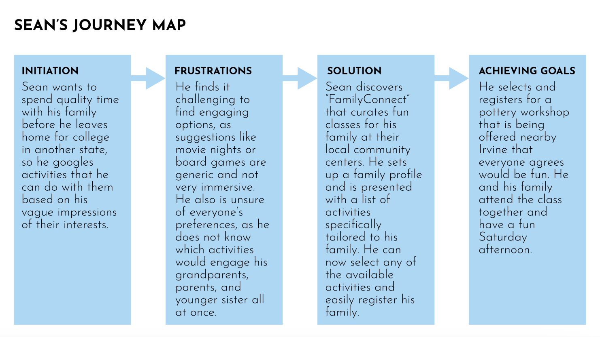

# UX Storytelling - Personas + Scenarios

## Tyler Youn

## UCLA DH110 Spring 2023

### Purpose of UX Storytelling

We want to step into the shoes of our users to understand the types of people that the application will target. To gain a deeper appreciation of their motivations, goals, feelings, emotions, and background, we develop personas to empathize with them. Using our user research as a guide, we adopt these personas and gain insights from the user's perspective.

### Proposed Features

1. Based on my usability heuristic research on the LA County Parks and Recreation web application, I found that the initial process of creating an account and signing up was lacking in that the design was not minimalistic and simple, and it was difficult to navigate for the users. They presented large walls of texts and lacked personalization, as they did not ask what interests or topics that the user had. Thus, one feature that my design solution will have is having <b> a simple family profile setup and setting the preferences and interests of everyone in the family. </b>
 
2. During my usability evaluation for the same application, my participant had some trouble when it came to finding a class that she was interested in taking by herself, let alone her entire family. The filtering box was laid out in a confusing order, making it tedious for the user to navigate with. So, the other feature that my design solution will have is <b> finding a class that you are interested in and booking it for multiple people in your family who may be interested. </b>

### Personas and Empathy Maps

#### Proto-Persona 1: Pamela Johnson

#### Pam's Empathy Map

#### Proto-Persona 2: Sean Smith

#### Sean's Empathy Map

### Scenarios

#### Scenario 1

One day, Pam, a stay-at-home mom, takes her two sons, who are in elementary school, to the library next to their local community center. While her children are browsing the shelves, she reads a poster on the bulletin board announcing that course sign ups are now open for a variety of topics. Interested, she uses her phone to look up LA County’s Parks and Recreation website to see what classes are available. Recently, she had been looking for some new activities that she could do with her family during the summer, as her parents would be visiting as well to stay with them. With her children being on vacation, she not only needed something to keep them occupied, she wanted to find a way to connect her family and create lasting memories. 

However, as she tries to navigate the website, she finds it overwhelming and challenging to select an activity that would cater to her children as well as their grandparents. She struggles to see exactly how the registration process works, as well as how she would sign up multiple people. She recalls a conversation with a friend where she hears about a new app called “FamilyConnect”. Curious, she downloads the application on her phone and sets up a family profile within minutes using its simple and intuitive process. 

After she is presented with multiple options based on her whole family’s interests on the home page, she selects a family cooking workshop that everyone can participate in. The course description details what exactly is included in the course, the schedules, and even ratings of the instructor. She is glad that the class would be taught by someone with experience and a good reputation. She clicks on the “Book” button, and is presented with options, such as who in her family will be participating, as well as which available dates work the best for her family. The booking process is simple, as most of the relevant information was gathered while she was setting up her profile. Paying for the class is also simple, as she can pay for her whole family at once. 

Once she confirms her booking, she receives an email that she can now forward to her grandparents to confirm with them as well. Pam is grateful that she found this app, as it simplified the process for her family while being excellent at curating fun shared activities for everyone in her family. She plans on using the application again, as it was extremely effective in building their family relationship and creating lasting memories. 

##### Pam's Journey Map

#### Scenario 2

Sean is a high school senior finishing up his last year before he heads off to college. He realizes that because of how busy he was in his Junior year, dealing with AP exams, college applications, and maintaining his high GPA, that he wasn’t able to spend a lot of quality time with his family. With the last few remaining months that he has, he decides to make it a priority to strengthen the connection with his family by participating in a shared activity with them.

He runs into an issue: he has a vague idea of his family’s interests, but doesn’t know where to begin or what kind of activities would be interesting for his family. He searches Google to find activities to do with his family like board games or movie nights, but is concerned that those options won’t be as immersive and engaging for his grandparents, his parents, and his younger sister as a whole. After doing some research, he falls upon an app called “FamilyConnect”, which helps families to find fun classes to take together in their local communities. Intrigued, Sean decides to give it a try. 

Once he installs the app, he is prompted with a sign up page, where he can register a family profile so that he can get personalized recommendations based on his entire family’s interests. He gathers his family in person to do the process together. He creates an account with his email address and password, which designates him as the main account holder. He is then asked about some basic information about himself and his family, such as the names and ages of his family members. On the next page, he fills out the profile further by adding his family's different interests, hobbies, and preferences for topics. He is also given the option to narrow down his search by location and date for different family members in the event of scheduling conflicts. After finishing his profile, he is sent to the home screen which recommends a list of interesting and fun courses that his family could take together. 

The overall process is intuitive for Sean, who finds the process easy and simple, as the app guides him in tailoring his family profile’s preferences. He likes the ability to input his family’s information and interests, and how it recommends classes based on everyone’s preferences.

