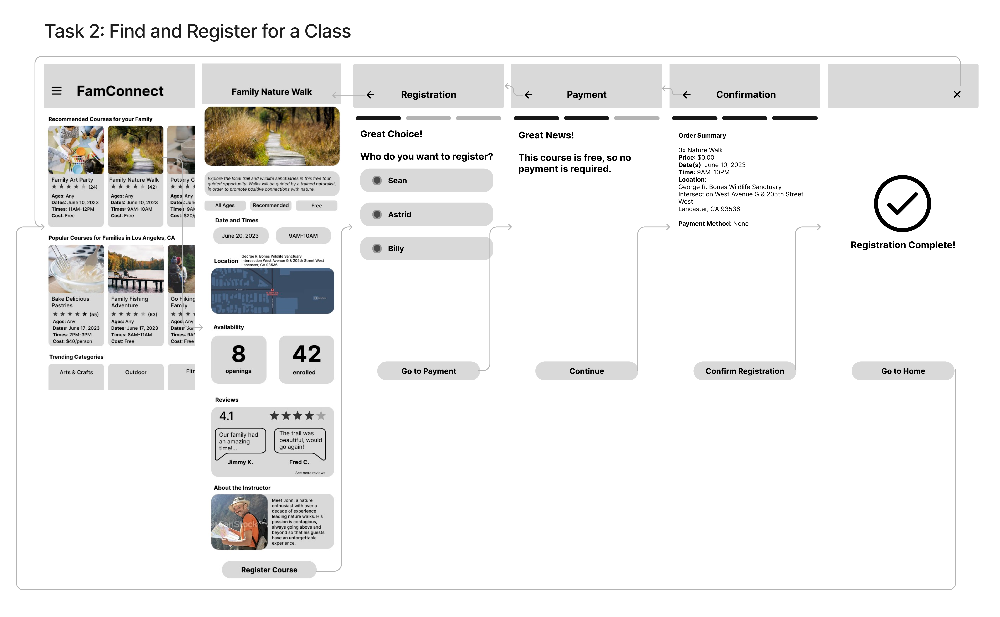

# Low Fidelity Prototype

## Tyler Youn

## UCLA DH110 Spring 2023

### Project Description

We take the results from the UX research that we did in the previous assignments to build the wireframe and flows for the product. 

From the usability testing done with the LA County Parks and Recreation web application, it was clear that there was a need for a simple profile setup process to create an
account to begin registering. From my interviews and persona research, I realized that users wanted a more personalized experience, which is why having a 
family profile setup would be effective at collecting that information to present to the users. 

So, <b> one feature and task is to create and setup a family profile to input everyone's settings and preferences. </b>

My testing also showed that when it came to register and sign up for a class, the participant preferred to easily sign up multiple people at once, which
was not intuitive on the LA County web application. The participant also struggled to find a class by using the filter. The persona scenario demonstrated
that having a useful filter option and a list of recommended courses would help the user more quickly find classes that their family is interested in.

So, <b> the second task is to search and register your family participants for a recommended course </b>.

The purpose of building a wireframe and flows is to start laying out the specific interactions from the user in order to fulfill the targeted task. Then,
by getting feedback we can refine and fix any confusing and unnecessary elements such that the overall experience of using the app is fundamentally improved. 

### Task 1: Creating a Family Profile

[Link to Flow](https://www.figma.com/proto/4iDCdne1obJxYrZUgDrkhk/FamConnect---Lofi?page-id=0%3A1&type=design&node-id=1-4&viewport=-95%2C-42%2C0.26&scaling=scale-down&starting-point-node-id=1%3A4)

### Task 2: Selecting and Registering for a Course 

[Link to Flow](https://www.figma.com/proto/4iDCdne1obJxYrZUgDrkhk/FamConnect---Lofi?page-id=0%3A1&type=design&node-id=19-264&viewport=-95%2C-42%2C0.26&scaling=scale-down&starting-point-node-id=1%3A4)

### Prototype

[Link to Full Prototype](https://www.figma.com/proto/4iDCdne1obJxYrZUgDrkhk/FamConnect---Lofi?page-id=0%3A1&type=design&node-id=1-4&viewport=-95%2C-42%2C0.26&scaling=scale-down&starting-point-node-id=1%3A4)

### Wireflow Testing Interview

[Interview Video](https://drive.google.com/file/d/1JcHxT3kjK-y1ZLp79AboU92l_Hc3l-fb/view?usp=sharing)

### Reflection
