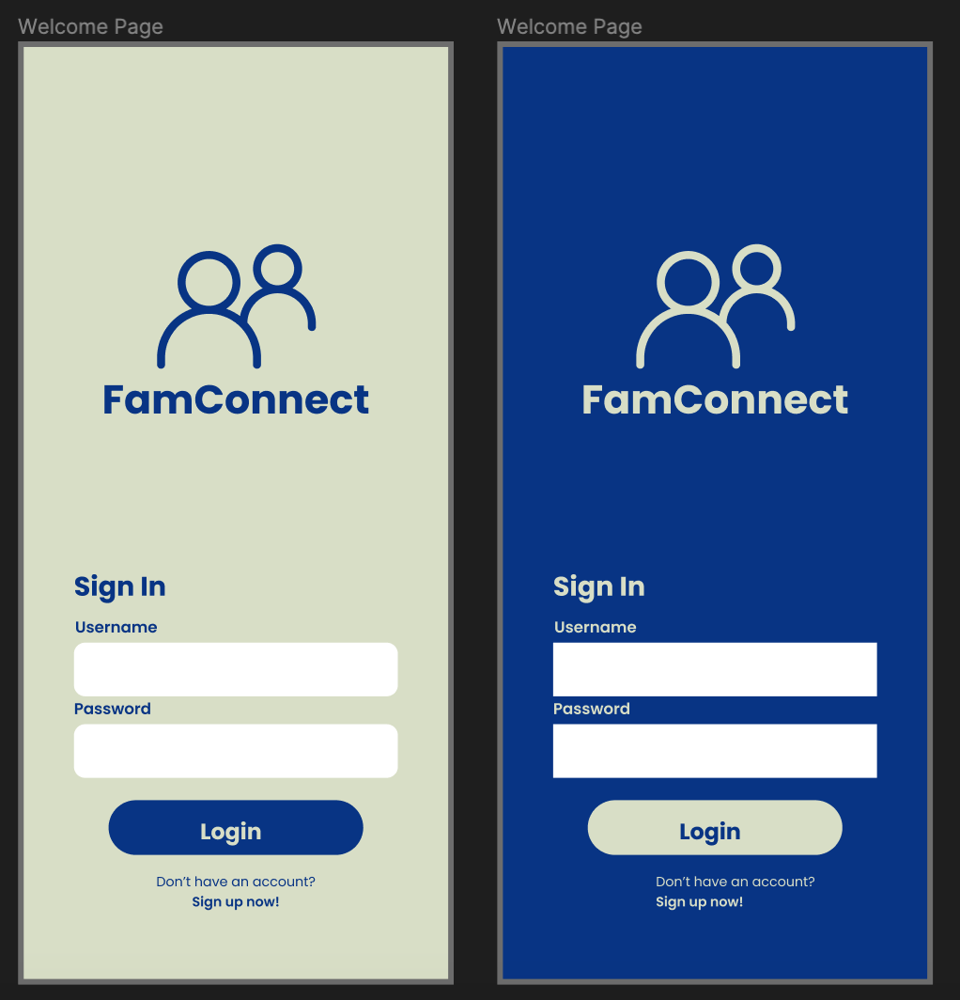

# Interface Design

## Tyler Youn

## UCLA DH110 Spring 2023

### Project Description

This assignment is based off of the wireframe of <b> FamConnect </b>,
and fleshes out a higher fidelity prototype for the interface. We want
to add more detail and refine the design, while our process and iterations.
This will be important in justifying the selected final design with
reasoning. 

So far, we've created wireframes and two flows for two scenarios 
based on our personas. I selected the "greeting" page, which is the
"Login page" of my wireframes. 

  

<i> Initial Wireframe from Low Fidelity </i>

To see the full prototype tool page to see all compiled designs, click [here](https://www.figma.com/proto/E2g7jNfSWoaL61kmesBRP2/FamConnect-Interface-Design?page-id=0%3A1&type=design&node-id=1-2&viewport=206%2C-981%2C0.44&scaling=scale-down).

### Screen Design

The following designs are iterations of the typography, shape,
and colors of the user interface. 

#### Typographic Variations

When designing this aspect of the interface, I looked at different typefaces from
https://fonts.google.com/, as they provided several different options for my app. I also
considered changing the size of the fonts for titles, subtitles, and body text. 

#### Shape Variations

For my login wireframe, I had a limited number of elements in which to add a variety of shapes. Specifically, I looked at rounded corners for my "Login" button component, and the input boxes for the username and password. 

#### Color Variations

I used different color theme tools to determine different color options, but I found [Khroma](https://khroma.co) to be most effective at finding the best color palette for my theme. I was looking for themes that were friendly and fun, while providing a sense of community. From my sources, I considered 3 different color palettes, and created both light and dark color themes. 

#### Layout Test

I set-up a grid system to best lay out the elements of my login page. 

### Impression Test

[Link to preliminary impression test](https://drive.google.com/file/d/1QHNQ1Bsdm1ma7oxxxXurjG3DeMxBmAtA/view?usp=sharing)

Summary of Findings: Overall, the short impression test went well, as the participant liked the color choices. She said words like "inviting" and "easy to read" which had to do with the color selections. By ensuring that the colors followed the contrast ratio, while considering various
color palletes, we enhance the experience of the application. She also mentioned the fonts, as the fonts that were chosen seem friendly and grounded. 

### Accessibility Test - Color Contrast

Testing for accessibility is an important aspect of interface design. For this assignment, I looked at accessibility in terms of color schemes, which can be done using a contrast checker. 

These tests were conducted  WCAG 2.0, to best determine the accessbility of the colors of the application. I used the Spark Figma plugin to collect scores for each of the color variations. 

  
   
  

### Design System

#### Summary of Graphic Design and Design Decisions for Graphical Interface. 
- Typeface: The font that was selected for the interface design was <b> Poppins </b>. I had considered other fonts, like Kanit and Bitter, but I felt that the softer and more rounded edges of this font would convey more of the "lighthearted fun" tone that I wanted to set. I also considered the thickness of the font, as having every text bolded would make it harder to emphasize certain elements. In particular, I made the "Username" and "Password" texts as semi-bold while doing the color design, as I noticed that having a thicker smaller font affected the readability of the text. Furthermore, I adjusted the size of the fonts to be more consistent. In my wire frame, I had inconsistent sizing of my fonts. I also did not follow the "1.5x" rule of thumb when it came to title font size vs body text font size. I adjust accordingly, and I set up sizes of 36, 24, and 14. I reserved the 36 size font for the title text, and 24 for the Login button, as it an important component that needs attention brought to it. 
- Color Scheme: I considered several color palletes, but ultimately decided on colors Tana and Everglade. I had to select a non-white background, and Tana gave a good off-white contrast with a green hue. I felt that the greener colors gave a sense of community and nature, which is partially related to the Parks and Recreation logo colors. With the Tana backgroud, I chose an Everglade color for the text. The darker color gives a nice contrast to the background, with a contrast WCAG 2.0 ratio of 8.27:1. The button inverts these colors however, as the background of the button is now Everglade and the text is Tana colored. This gives a good contrast and variety, while bringing focus to the login button. I also created the dark theme version of the application login page, where I inverted the colors. So the background is Everglade and the text is Tana.  
- Layout Grid + Spacing: I split of the layout of the login page into a grid system. I decided to split the page into four columns. The reason for this split was because the login page doesn't require horizontal scrolling or information. Thus, I used the columns primarily to center and provide the right spacing for the elements vertically. Using the same feature though, I adjusted the margins (20px) on each side, so that there is space between the edge of the screen and the login elements. I also decided to split the page into 7 rows. Compared to the horizontal, it is possible that the interface scrolls vertically. I also needed to provide adequate spacing for around 6 main elements of information on the page. To ensure proper spacing, I set the gutters of the rows to 20px.

