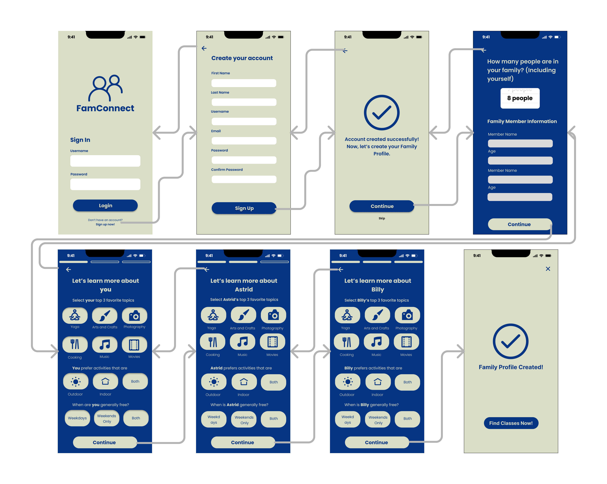
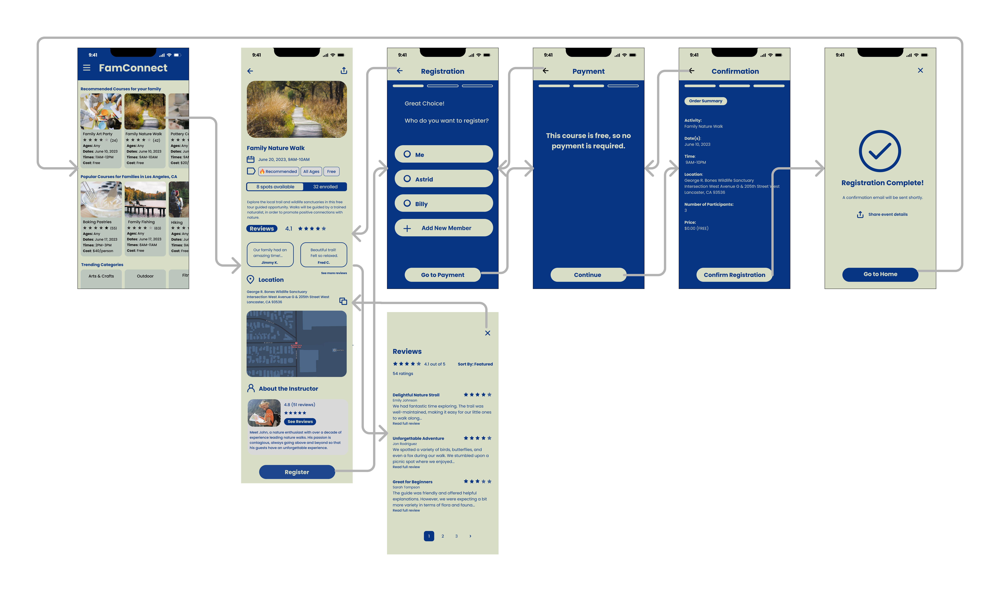

# Interactive Prototype

## Tyler Youn

## UCLA DH110 Spring 2023

### Project Description

The purpose of this assignment is to further develop the work and lower fidelity prototypes to visualize how the information and interactions will work on the application. In this part of the project, we want to try to focus on the factors that influence the overall user interaction with the system, and polish the design as well. 

In this process, we'll introduce two interactive tasks that can be accomplished with an interactive prototype. Using all of the design choices from the previous assignments, we can begin to hone down the prototype to work towards a final version of the design. Then, we'll show how those tasks will be accomplished using a wireflow. Finally, the interactive prototype will allow for a demonstration of the flow. 

### Interactive Prototype Tasks

#### Task 1: Creating a Family Profile

The first task is the ability to create a family profile. We wanted to improve on the existing LA Parks & Recreation activity sign up, by adding more personalization to the course selection. By setting up a family profile, we can try to offer recommended courses based on the preferences of the family. It is also meant to be simple, intuitive, and, brief, since we don't want to overload the user with information. 

#### Task 2: Registering for a Class

The second task is the interface to select and register for a class. The user should be able to easily select a course, and be presented with the most important and relevant information, such as the spots avaiable, location, ratings, and more. Moreover, it should provide for a simple and easy regstration process, such that the single account holder can register multiple people in the family at once. 

### Wireflow with Graphic Design

#### Task 1 Wireflow

#### Task 2 Wireflow

### Links

#### [Task 1 Flow Prototype](https://www.figma.com/proto/5l8zgUIN22RhNNb4DzaPMl/Final-High-Fidelity?type=design&node-id=0-1&viewport=576%2C521%2C0.3&scaling=min-zoom&starting-point-node-id=1%3A12209&show-proto-sidebar=1)

#### [Task 2 Flow Prototype](https://www.figma.com/proto/5l8zgUIN22RhNNb4DzaPMl/Final-High-Fidelity?type=design&node-id=0-1&viewport=576%2C521%2C0.3&scaling=min-zoom&starting-point-node-id=1%3A11942&show-proto-sidebar=1)

#### [All Wireframes and Components](https://www.figma.com/file/5l8zgUIN22RhNNb4DzaPMl/Final-High-Fidelity?type=design&node-id=0%3A1&t=rIJ0YKp7fqvz3h5l-1)
